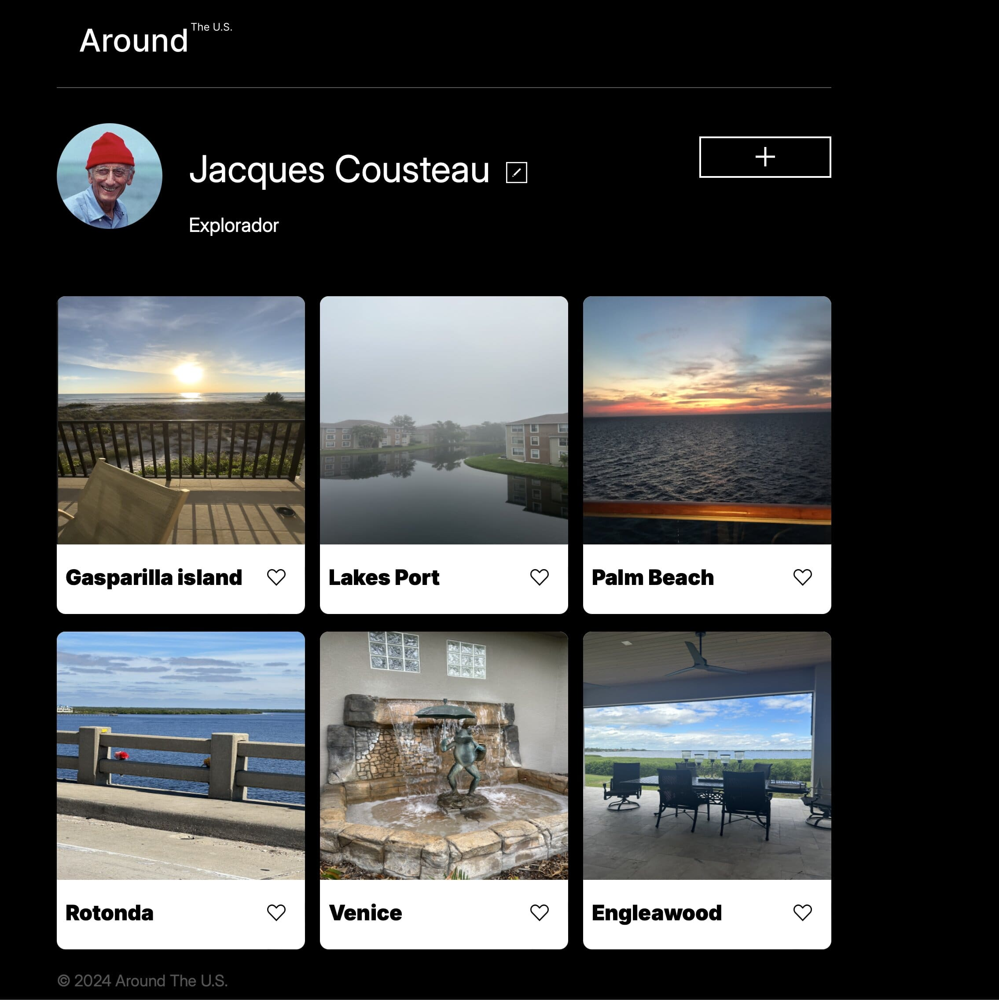

# Tripleten web_project_around

Projeto "AroundUs : Ao redor dos Estados Unidos"

Este é um projeto desenvolvido com o uso das tecnologias HTML, CSS e JavaScript. O objetivo principal é apresentar algumas imagens de locais nosEstados Unidos.

Funcionalidades

Visualização de Imagens: O projeto permite aos usuários visualizarem uma variedade de imagens de diferentes lugares ao redor dos Estados Unidos.
Navegação simples: A navegação é de facil acesso, proporcionando uma experiência agradável ao usuário.
Responsividade: O layout se adapta a diferentes tamanhos de tela. Desktop, tablet e smartphone
Personalização do Perfil: Os usuários podem alterar o nome e o cargo do perfil exibido.
Likes nas Fotos: Os coracoes nas fotos sao clicaveis, podendo deixar o seu like caso goste da foto.
Tecnologias Utilizadas

HTML: Utilizado para estruturar o conteúdo da página, permitindo uma organização dos elementos.
CSS: Responsável pela estilização e aparência visual do projeto.
JavaScript: Implementado para adicionar interatividade ao projeto ; like nas fotos, alteracao de dados no perfil e abertura e fechamento do popup formulario.

Como acessar?

Nesse link : https://muriloandra.github.io/web_project_around/

Projeto efetuado by;

Este projeto foi desenvolvido por Murilo Andrade . Você pode entrar em contato via [Muriloandra@icloud.com] para mais informações.

Fique a vontade para deixar seus likes rs pelos lugares fascinantes nos Estados Unidos! 🇺🇸📷
