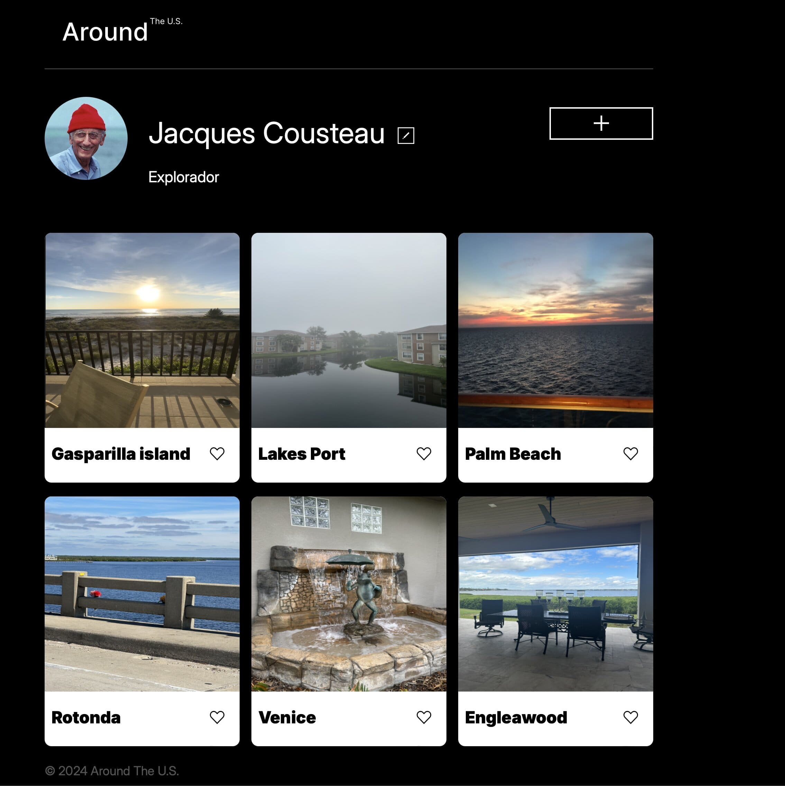
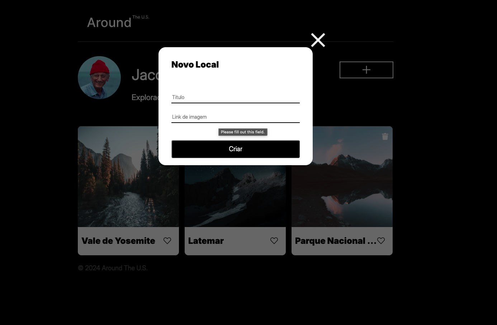
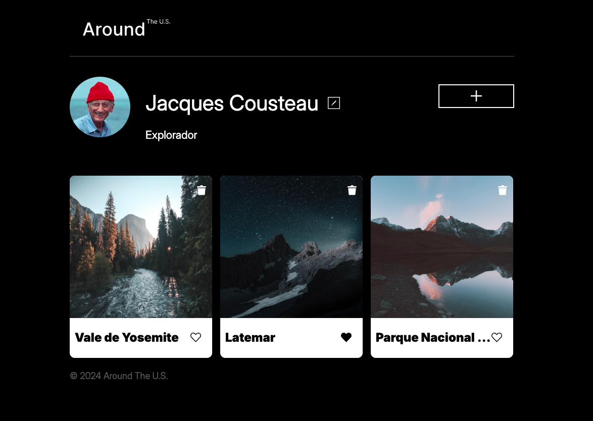
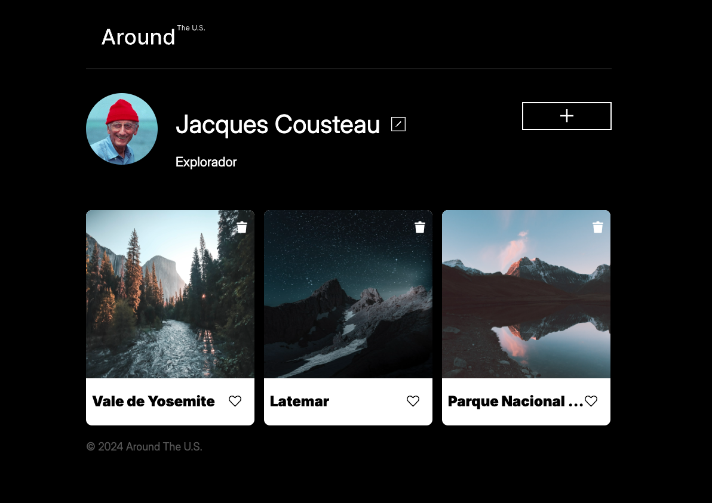
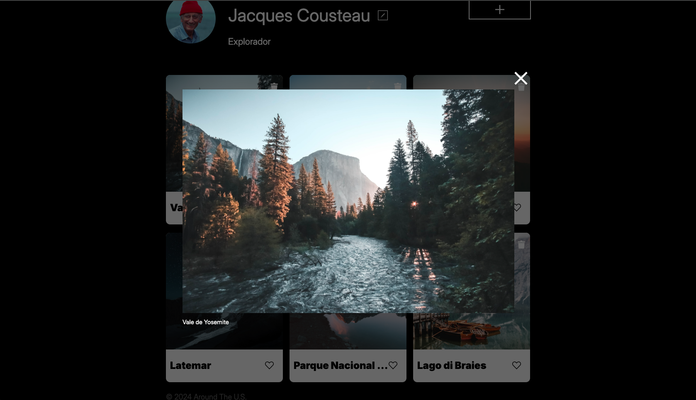

# Tripleten web_project_around

Previa da pagina e das funcionalidades

Projeto "AroundUs : Ao redor dos Estados Unidos"

Este é um projeto desenvolvido com o uso das tecnologias HTML, CSS e JavaScript. O objetivo principal é apresentar algumas imagens de locais nos Estados Unidos.

Funcionalidades

Visualização de Imagens: O projeto permite aos usuários visualizarem uma variedade de imagens de diferentes lugares ao redor dos Estados Unidos.

Navegação simples: A navegação é de facil acesso, proporcionando uma experiência agradável ao usuário.

Responsividade: O layout se adapta a diferentes tamanhos de tela. Desktop, tablet e smartphone

Personalização do Perfil: Os usuários podem alterar o nome, cargo do perfil exibido, inserir imagem via link url, alterar o nome da imagem, abrir e fechar a imagem.

Likes nas Fotos: Os coracoes nas fotos sao clicaveis, podendo deixar o seu like caso goste da foto.

"Validação dos formulários utilizando JavaScript.

Utilização da tecla Esc para fechar formulários e pop-ups.

Fechando formulários utilizando o clique externo.

Tecnologias Utilizadas

HTML: Utilizado para estruturar o conteúdo da página, permitindo uma organização dos elementos.

CSS: Responsável pela estilização e aparência visual do projeto.

JavaScript: Implementado para adicionar interatividade ao projeto ; like nas fotos, alteracao de dados no perfil e abertura e fechamento do popup formulario.

Como acessar?

Nesse link : https://muriloandra.github.io/web_project_around/

Projeto efetuado by;

Este projeto foi desenvolvido por Murilo Andrade . Você pode entrar em contato via [Muriloandra@icloud.com] para mais informações.

Fique a vontade para deixar seus likes rs pelos lugares fascinantes nos Estados Unidos! 🇺🇸📷
